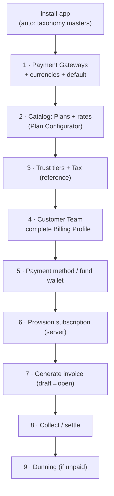

# Billing — Setup & Demo Runbook (empty site → working billing)

> How to stand up billing on a **fresh `central.local` site** and demonstrate it, as the
> admin, from scratch. Two paths:
>
> - **Path A — Seed** (recommended for a demo): one command builds a rich, self-consistent
>   set of teams covering every feature. Use this to *show* billing.
> - **Path B — Manual** (to *understand* the config surface): configure each piece by hand,
>   the way a real operator onboards a fresh deployment.
>
> Companion docs: [`ARCHITECTURE.md`](./ARCHITECTURE.md) (how the code is wired),
> `../../spec/README.md` (specs). Paths below are relative to `central/billing/`; bench
> commands run from the bench root (`cenral-bench/`).

---

## 0. Prerequisites (both paths)

1. **A bench + site.** App installed on the site (this runs `after_install` →
   `catalog.taxonomy_setup.ensure_catalog_masters`, which seeds the catalog taxonomy
   masters — Plan Category / Sub-Category / Resource Type — that nothing else can run
   without).
   ```bash
   bench new-site central.local
   bench --site central.local install-app central
   ```
2. **Gateway test keys** in `sites/common_site_config.json` (never commit these; the
   adapters read them via `frappe.conf`):
   ```json
   {
     "stripe_secret_key": "sk_test_…",  "stripe_publishable_key": "pk_test_…",
     "razorpay_key_id": "rzp_test_…",   "razorpay_key_secret": "…"
   }
   ```
   The **seed** path uses placeholder keys (`skip_credential_validation`) and runs offline;
   only real charges / top-ups / e2e need live test keys.
3. **Bench running** (node ≥ 24 on PATH or honcho tears the bench down):
   ```bash
   PATH="$HOME/.nvm/versions/node/v24.16.0/bin:$PATH" bench start
   ```
4. Build the dashboard SPA if you'll click through the UI: `cd apps/central && yarn build`.

---

## Path A — Seed a demo in one command

```bash
# Rich, full-spectrum dataset (10 teams: tiers t0–t3, INR/EUR/USD, every collection
# mode + standing — Active, Grandfathered, Overdue, Suspended, Trial, Refund, Credits):
bench --site central.local execute central.billing.demo.demo_scenarios.seed_all

# …or the compact feature-coverage set (each settlement path exercised once,
# one 24-instance fleet team to fill the invoice line-item table):
bench --site central.local execute central.billing.demo.demo_scenarios.seed_demo

# Sanity counts proving each criterion is covered:
bench --site central.local execute central.billing.demo.demo_scenarios.summary
```

What `seed_all` builds (in order): trust tiers → catalog (Atlas clusters, Plans, rates,
the metered Bandwidth Overage) → gateways (Stripe per-currency, Razorpay INR, PayPal) →
Ed25519 signing key → then per team: members, billing profile, tier, tax, subscriptions,
historical Paid invoices, the current (June) invoice in the team's terminal state.

The seed is **idempotent + destructive**: it `_wipe_all()`s billing data first, so re-run
freely. Administrator is a System Manager and lands on a team with data — just open
`http://central.local:8011` and go to the billing dashboard.

### What each demo team demonstrates
| Team | Currency | Tier | State | Shows |
|---|---|---|---|---|
| acme-corp | INR | t3 | Grandfathered | price-lock / locked rate, e-mandate > ₹15k → Action Required |
| globex / initech | EUR / USD | t3 / t2 | Active | standard card postpaid, multi-region fleet |
| umbrella / wayne-ent | INR | t2 | Active | Manual Checkout / e-mandate pre-debit ≤ ₹15k |
| stark-ind | INR | t1 | Overdue | dunning retry trail → past_due |
| cyberdyne | EUR | t1 | Suspended | suspension end-state |
| hooli | INR | t1 | Credits | prepaid wallet settlement |
| soylent | USD | t1 | Refund | refund to wallet / source |
| piedpiper | INR | t0 | Trial | entry-tier free-credits model |

---

## Path B — Configure from scratch as admin

The order matters: **reference data → catalog → gateways → customer → money**. Each step
names the UI doctype and the programmatic call so you can do either.



### Step 1 · Payment Gateways
Create a **Payment Gateway** per rail. Required: `title`, `adapter_key`
(`Stripe` / `Razorpay` / `Paypal`), the secret fields, `is_enabled`, and a **currencies**
child row with `is_default` set for the currency it serves. Razorpay needs
`supports_mandates` for UPI Autopay / e-mandate.
- **UI:** Desk → *Payment Gateway* → New (one per currency for Stripe; one INR Razorpay).
- **Admin API:** `api/admin/gateways` → `get_gateways`, `set_default_gateway`,
  `get_effective_routing` (which gateway wins for a currency).
- Routing rule: `gateways/registry.resolve_gateway_for_currency` picks the default-enabled
  gateway for the invoice currency.

### Step 2 · Catalog — Plans & rates
Taxonomy masters are already seeded. Now create **Plans** and **price them per cluster ×
currency** (rates live in standalone **Catalog Rate**, not on the Plan).
- **Preferred:** the **Plan Configurator** is the single pricing authority (ADR 0011).
  Desk → *Plan Configurator*: pick a category/sub-category, set base rates + a t-shirt-size
  ladder, then `generate_plans` / `apply_pricing` mints the Plans and their rates.
  (`catalog/configurator.py`; whitelisted via the doctype controller.)
- **Direct:** `catalog/plans.create_configured_plan`, then
  `catalog/pricing.set_catalog_rates("Plan", plan, [{cluster, currency, rate}, …])`.
- Verify a price: `catalog/pricing.resolve_rate` / `get_plan_pricing`.

### Step 3 · Trust tiers & Tax (reference data)
- **Trust Tier Level** rows with per-currency **Trust Tier Threshold** children define the
  spend caps a team climbs through. Caps resolve live (`catalog/entitlements.get_team_caps`);
  there is no per-team tier doctype.
- **Tax Profile** per team drives GST (additive) / SEZ (zero-with-reason) / TDS (withholding)
  — `revenue/tax.resolve_tax`. India GST codes live in `india_gst.py`.

### Step 4 · Customer Team + Billing Profile
Money movement is **gated on a complete Billing Profile** — its `currency` is the source of
truth (gateway-backed, locks after first activity).
```bash
bench --site central.local execute central.billing.payments.profile.create_or_update_billing_profile \
  --kwargs '{"team": "<TEAM>"}'
```
- **UI:** the customer SPA first-run wizard (`api/dashboard/account.save_billing_profile`).
- Set currency + country (GST state for INR) before any charge.

### Step 5 · Payment method or wallet funding
- **Card:** `api/dashboard/methods.initiate_card_setup` → `confirm_card` (real Stripe
  SetupIntent), or `add_demo_card` for an offline demo.
- **Wallet top-up:** `api/dashboard/invoices.create_topup_order` → `confirm_topup`, or
  programmatically `revenue.credits.purchase(team, amount, currency, …)` → appends a
  **Credit Ledger Entry** and updates the **Credit Wallet**.
- INR rails: `payments/collection_mode` enforces the ₹15k silent-debit ceiling, read off the
  gateway's currency row (ADR 0022); set the team's mode (Auto Charge / Manual Checkout / Prepaid).

### Step 6 · Provision a subscription (a "server")
```bash
bench --site central.local execute central.billing.catalog.subscriptions.provision_subscription \
  --kwargs '{"team":"<TEAM>","cluster":"in-mumbai","plan":"plan-2vcpu","billing_cycle":"Monthly"}'
```
Creates the **Subscription** (intent) + first **Subscription Change** row carrying the
`locked_rate`, and provisions the Asset via cluster-manager. Composed configs:
`provision_composed_subscription(team, cluster, includes, sub_category, …)` or the UI
`api/dashboard/catalog.provision_composed_config`.

### Step 7 · Generate the invoice
> Invoice generation runs on the scheduler as two ticks on the 1st (see
> `ARCHITECTURE.md` §3), each fanning work out to workers. For a demo, drive it by hand —
> the calls below are the same work without the queue.
```bash
# One team, one period (in arrears):
bench --site central.local execute central.billing.revenue.invoicing.generate_team_invoice \
  --kwargs '{"team":"<TEAM>","period_start":"2026-06-01","period_end":"2026-06-30"}'
# …or all teams for the period (the draft phase, inline):
bench --site central.local execute central.billing.revenue.invoicing.generate_draft_invoices \
  --kwargs '{"period_start":"2026-06-01","period_end":"2026-06-30"}'
```
Lines come from `invoicing/lines.compute_line_items` (day-weighted Subscription Change
segments) + metered overage + commitment discount + tax. Result: **Invoice (Draft)**.

### Step 8 · Open & collect (settle)
```bash
# The collect phase — runs the credits→card waterfall per draft:
bench --site central.local execute central.billing.revenue.invoicing.open_drafts \
  --kwargs '{"period_end":"2026-06-30"}'
```
`open_and_collect` applies credits first, charges the card for the remainder, and flips
Draft → Open → (on webhook) Paid. On a local bench you won't receive a live webhook — the
e2e suite delivers it via `tests/e2e.py:deliver_webhook` from a real captured txn id; for a
manual demo, the seed path already shows Paid invoices.

### Step 9 · Dunning (unpaid path)
Leave an invoice unpaid and run the daily job to walk the Day 1/3/7 retries → past_due →
suspend:
```bash
bench --site central.local execute central.billing.revenue.dunning.run_dunning
```

---

## Reset / teardown

```bash
# Re-seeding wipes billing data first, so just re-run the seed to reset:
bench --site central.local execute central.billing.demo.demo_scenarios.seed_all

# Or wipe billing records only (leaves catalog/gateway config):
bench --site central.local execute central.billing.demo._factory._wipe_all
```

For e2e isolation, each Playwright spec seeds + tears down its own sandbox via
`central/billing/tests/e2e.py` (`seed`/`teardown`, gated behind `allow_tests: true`). See
`e2e/README.md`.

---

## Quick reference — what's automatic vs. manual

| Piece | Auto (on install/migrate) | Manual (admin) |
|---|---|---|
| Catalog taxonomy masters | ✅ `ensure_catalog_masters` | — |
| Payment Gateways + keys | — | ✅ Desk / admin API + `common_site_config.json` |
| Plans + rates | — | ✅ Plan Configurator |
| Trust tiers / Tax profiles | — | ✅ reference data |
| Billing Profile (per team) | — | ✅ wizard (gates money) |
| Invoice generation | ✅ two cron ticks on the 1st (draft, then collect) | ✅ `run_monthly_billing` / `generate_*` / `open_drafts` |
| Dunning / reconciliation / e-mandate / card expiry | ✅ scheduled | — |
